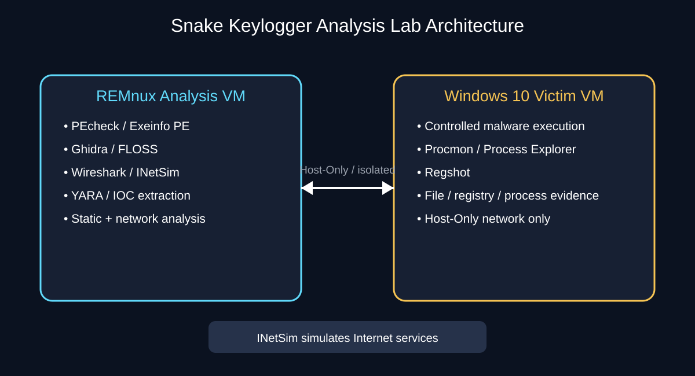
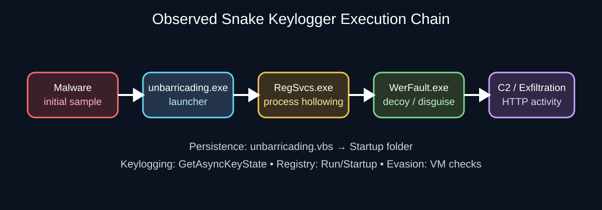
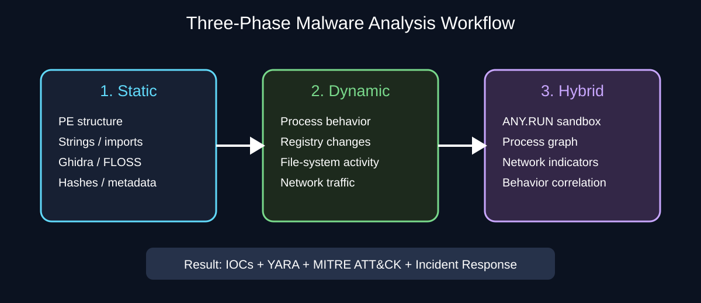
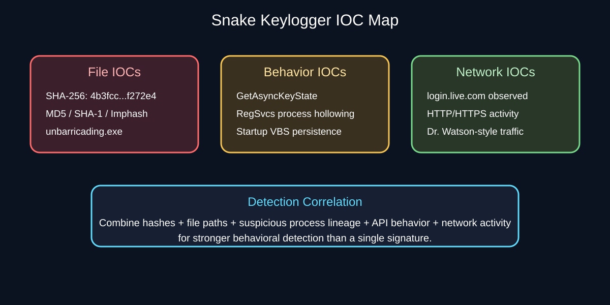
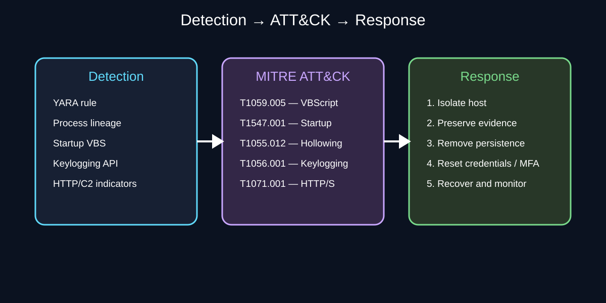

# Snake Keylogger — Malware Analysis & Reverse Engineering

> **Educational / defensive cybersecurity research repository**

This repository presents a controlled Snake Keylogger malware-analysis project with a clear visual walkthrough, extracted IOCs, YARA detection logic, MITRE ATT&CK mapping, and incident-response guidance.

## What This Project Demonstrates

1. **Static analysis** — understand the PE structure, imports, strings, hashes and code without execution.
2. **Dynamic analysis** — observe processes, files, registry changes and network behavior inside an isolated VM.
3. **Hybrid analysis** — correlate manual findings with sandbox behavior and the complete process chain.

## Lab Architecture

**Explanation:** REMnux is used as the analyst workstation and network-simulation platform. Windows 10 is the isolated victim VM. The Host-Only network keeps the laboratory separated from the real network, while INetSim provides simulated Internet services.

## Malware Execution Chain

**Explanation:** The report documents the chain from the initial malware sample to unbarricading.exe, process hollowing into legitimate RegSvcs.exe, use of WerFault.exe as a disguise, and HTTP-based communication.

## Analysis Workflow

**Explanation:** Static analysis reveals capabilities and indicators before execution. Dynamic analysis shows what the sample actually changes or launches. Hybrid analysis correlates those findings into a complete behavioral picture.

## Key Findings

| Area | Finding |
|---|---|
| Malware family | Snake Keylogger |
| File type | PE32 executable |
| Reported builder | AutoIt3 |
| Keylogging | GetAsyncKeyState |
| Persistence | Startup folder / registry persistence |
| Injection | Process hollowing into RegSvcs.exe |
| C2 | HTTP/HTTPS activity |
| Masquerading | WerFault.exe / Microsoft Dr. Watson user-agent |
| Anti-analysis | VM/environment checks and timing checks |
| Primary SHA-256 | 4b3fccf8e3e8cf25b5b63ba8f397687dd733fd884efe7c78083d154310f272e4 |

## IOC Map

**Explanation:** Strong detection should correlate multiple evidence types rather than rely on a single hash. The project documents file hashes, suspicious filenames, process behavior, API usage, persistence artifacts and network indicators.

See docs/IOCs.md for the extracted indicators.

## YARA Detection

The repository includes a defensive YARA rule at rules/snake_keylogger_autoit.yar.

The rule combines PE validation, AutoIt characteristics, persistence artifacts, process-hollowing indicators, keylogging APIs and HTTP/C2 strings.

## MITRE ATT&CK & Incident Response

**Explanation:** Observed behavior is mapped to ATT&CK techniques so defenders can build detections around behaviors such as VBScript execution, Startup persistence, process hollowing, keylogging and HTTP/S communication. The response workflow then covers isolation, evidence preservation, eradication, credential protection and recovery.

See docs/MITRE-ATT&CK.md.

## Tools Used

- REMnux
- Windows 10 VM
- VirtualBox
- INetSim
- PEcheck
- Exeinfo PE
- Ghidra
- FLOSS
- Sysinternals Process Monitor
- Sysinternals Process Explorer
- Regshot
- ANY.RUN
- YARA

## Project Structure

snake-keylogger-analysis/
├── README.md
├── .gitignore
├── report/
│   └── Analysis-Summary.md
├── rules/
│   └── snake_keylogger_autoit.yar
└── docs/
    ├── IOCs.md
    ├── MITRE-ATT&CK.md
    └── visuals/
        ├── lab-architecture.svg
        ├── execution-chain.svg
        ├── analysis-workflow.svg
        ├── ioc-map.svg
        └── defense-mapping.svg

## Safety Notice

**Do not execute malware on a normal host, personal computer, production system, or unrestricted network.**

This repository intentionally does **not** contain the malware executable. It contains defensive analysis documentation and visual/detection artifacts.

The original 49-page PDF report was supplied separately with this project. The GitHub connector available for this session cannot write binary PDF files directly, so the repository contains the report's extracted analysis summary and visual explanations instead.

## Author

**Mohamed Unaiz**

Malware Analysis • Reverse Engineering • Cybersecurity Research